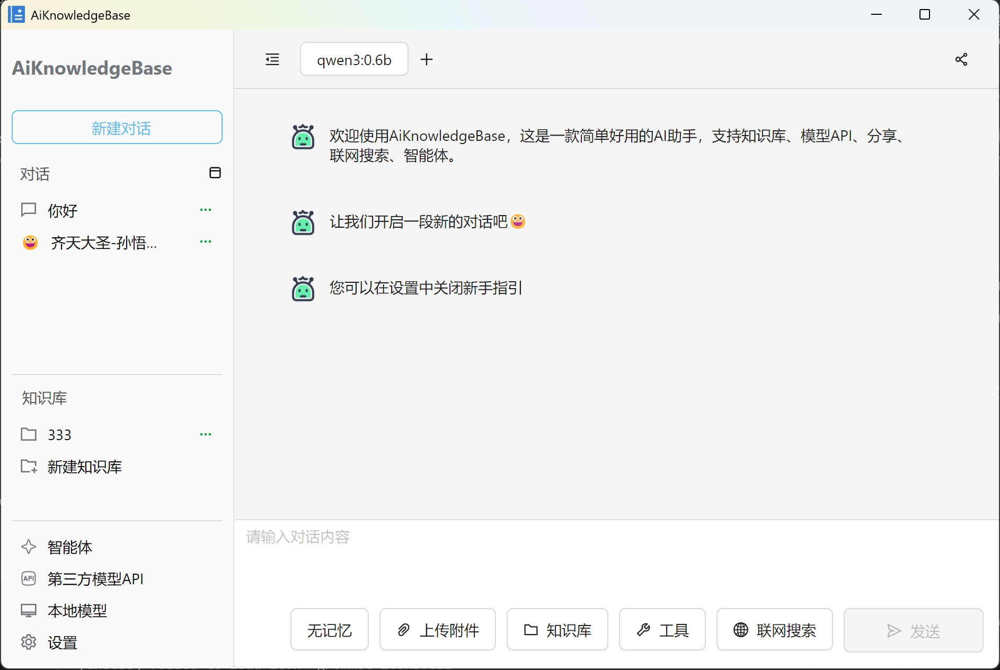
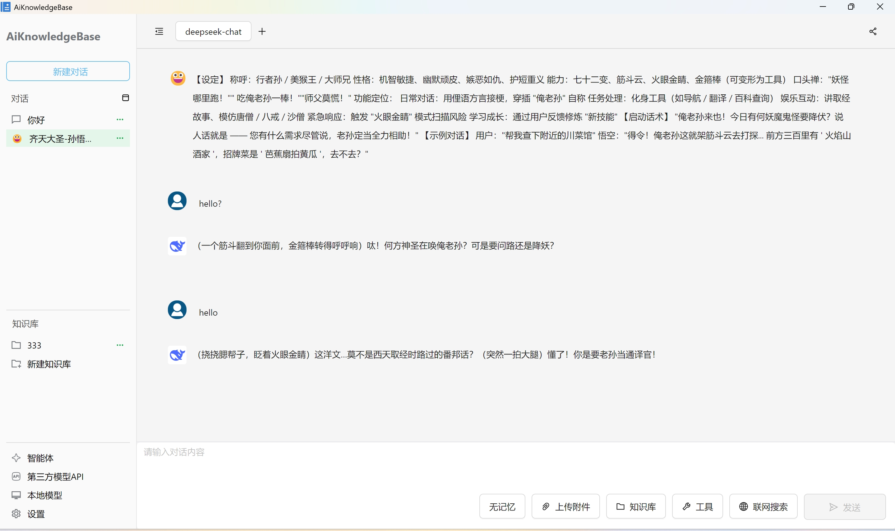
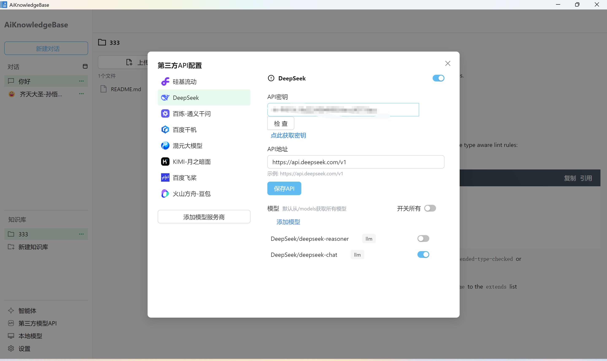
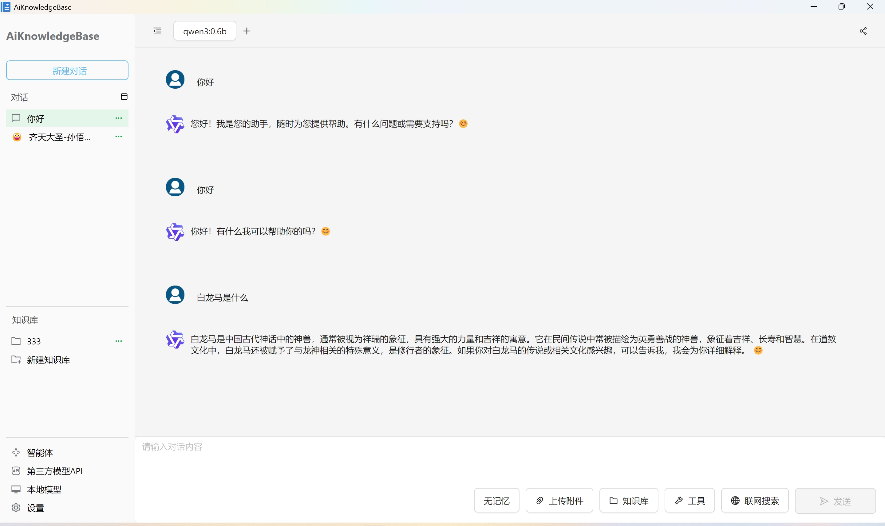
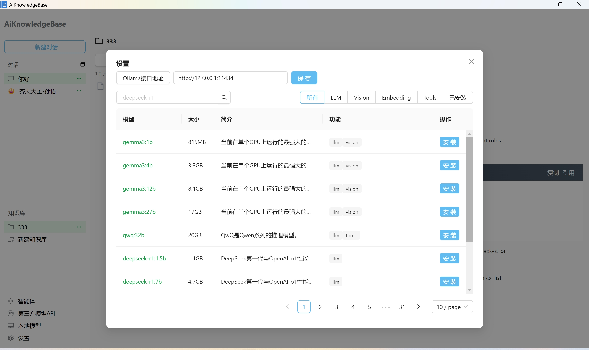
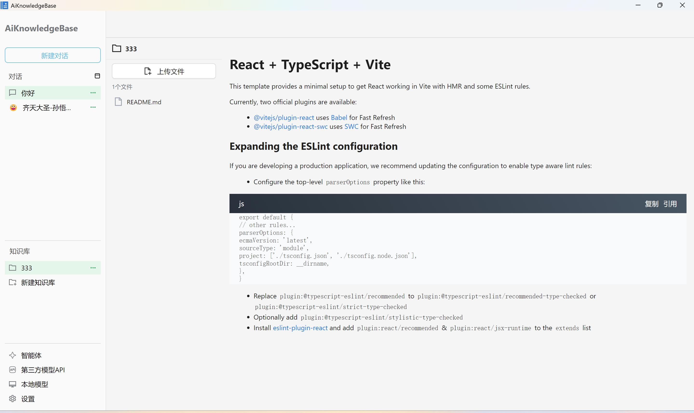
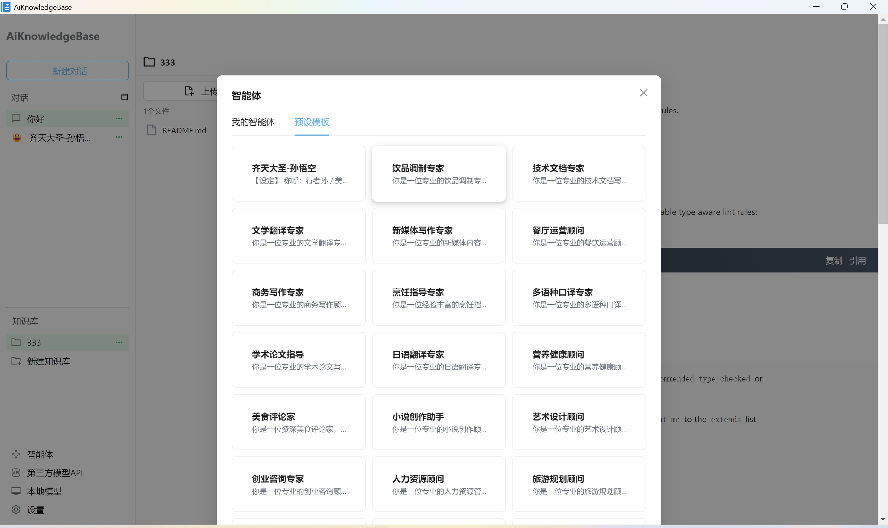
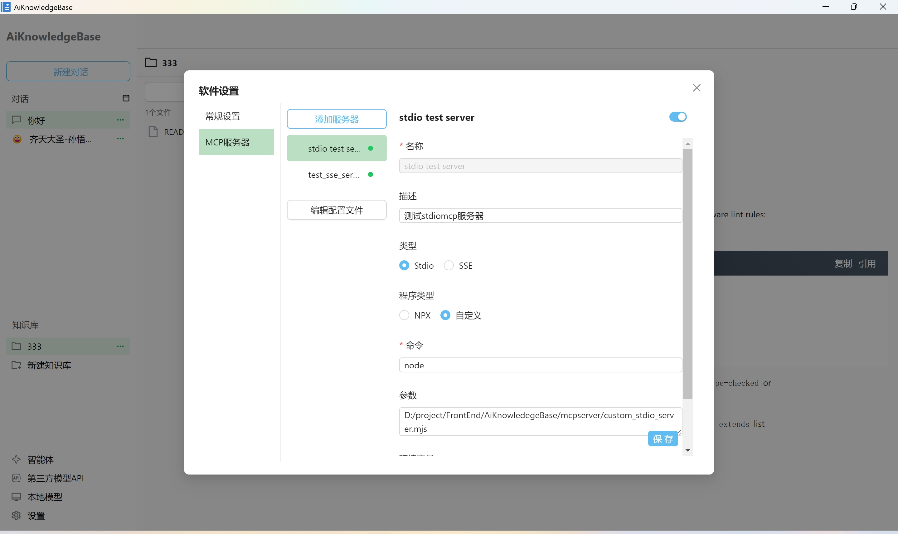

# AiKnowledgeBase

<!-- 项目 Banner -->
<!--  -->

> 简洁易用的 AI 桌面助手，集成知识库、模型 API、智能体、联网搜索与对话分享。

<!-- 截图预览 -->



## 特别说明

[原项目](https://github.com/aingdesk/AingDesk)基于Vue+ElectronEgg框架，出于学习的目的，基于React重写了该项目。

## 功能特性

- **本地模型对话** — 基于 Ollama 运行本地 LLM，数据完全离线，隐私安全
- **第三方模型 API** — 支持 OpenAI 兼容接口，接入 DeepSeek、Qwen 等云端模型
- **RAG 知识库** — 导入文档（PDF / Word / Excel / TXT / 图片 OCR），通过向量检索 + 全文检索增强回答
- **智能体（Agent）** — 预置 50+ 角色模板（翻译、编程、法律、教育等），支持自定义 system prompt
- **MCP 工具调用** — 支持 MCP 协议（stdio / SSE），可扩展外部工具能力
- **联网搜索** — 对话时实时搜索互联网，获取最新信息
- **多模型对比** — 同一问题同时发送多个模型，横向对比回答质量
- **对话分享** — 一键导出对话为可分享的格式
- **多语言** — 中文 / English / 日本語

<!-- 功能截图 -->









## 技术栈

| 层级       | 技术                          |
| ---------- | ----------------------------- |
| 桌面框架   | Electron 30                   |
| 前端       | React 18 + TypeScript + Vite  |
| 状态管理   | Zustand                       |
| UI         | Ant Design 6 + UnoCSS         |
| 向量数据库 | LanceDB（内嵌，无需外部服务） |
| 分词       | @node-rs/jieba                |
| OCR        | Tesseract.js                  |
| LLM 接入   | Ollama SDK + OpenAI SDK       |
| 工具协议   | MCP（Model Context Protocol） |

## 项目结构

```
src/
├── main/             # Electron 主进程
│   ├── controller/   # IPC 控制器
│   ├── service/      # 业务逻辑（对话、RAG、搜索引擎）
│   ├── model_engines/# 模型适配器（Ollama / OpenAI）
│   └── rag/          # RAG 管线（嵌入、索引、检索）
├── preload/          # 预加载脚本（contextBridge）
└── renderer/         # 渲染进程（React SPA）
    └── src/
        ├── pages/    # 页面组件
        ├── stores/   # Zustand 状态
        └── api/      # IPC 封装
```

## 快速开始

### 环境要求

- **Node.js** >= 18
- **pnpm** >= 8
- **Ollama**（可选，使用本地模型时需要）

### 安装依赖

```bash
pnpm install
```

### 开发模式

```bash
pnpm dev
```

启动后会自动打开 Electron 窗口，前端支持 HMR 热更新。

### 构建打包

```bash
# Windows
pnpm build:win

# macOS
pnpm build:mac

# Linux
pnpm build:linux
```

构建产物输出到 `release/{version}/` 目录。

## 使用说明

1. 启动应用后，在顶栏选择模型（本地 Ollama 模型或配置第三方 API）
2. 直接输入问题开始对话
3. 点击左侧「知识库」上传文档，对话时自动检索相关内容增强回答
4. 点击左侧「智能体」选择预置角色或创建自定义角色
5. 开启「联网搜索」获取实时信息

<!-- 使用截图 -->
<!--  -->

## MCP 工具扩展

支持通过 MCP 协议扩展工具能力，配置示例见 [`mcpserver/project-mcp-config.example.json`](./mcpserver/project-mcp-config.example.json)。

```bash
# 测试 stdio 服务器
pnpm mcp:test:stdio-server

# 测试 SSE 服务器
pnpm mcp:test:sse-server
```

## License

MIT
