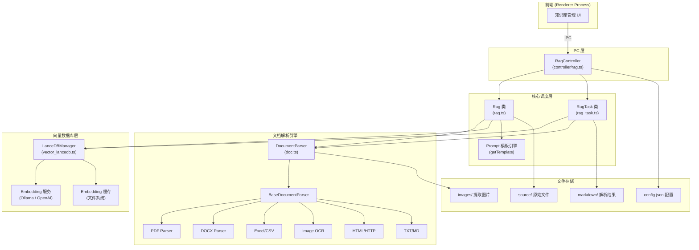
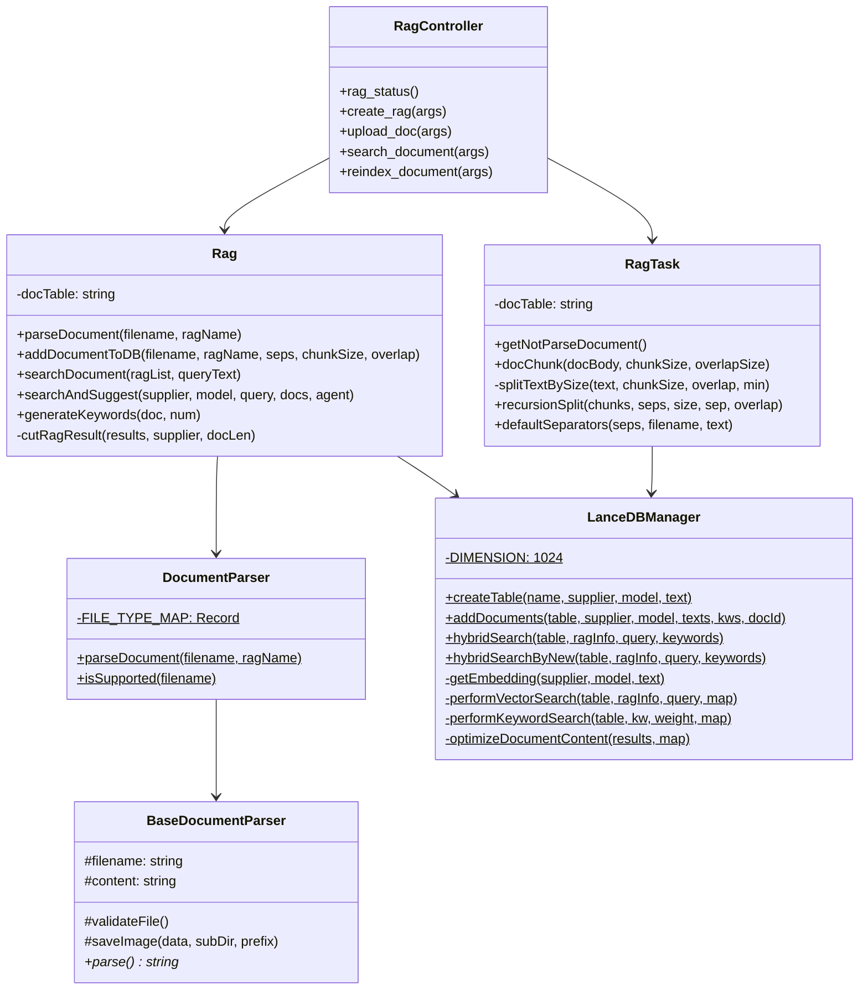
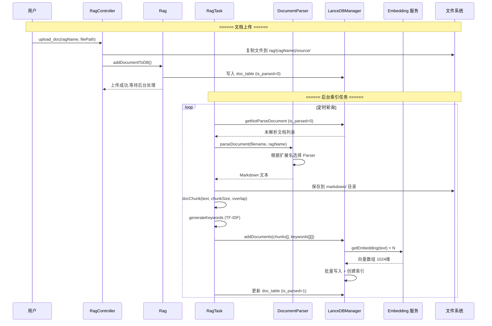
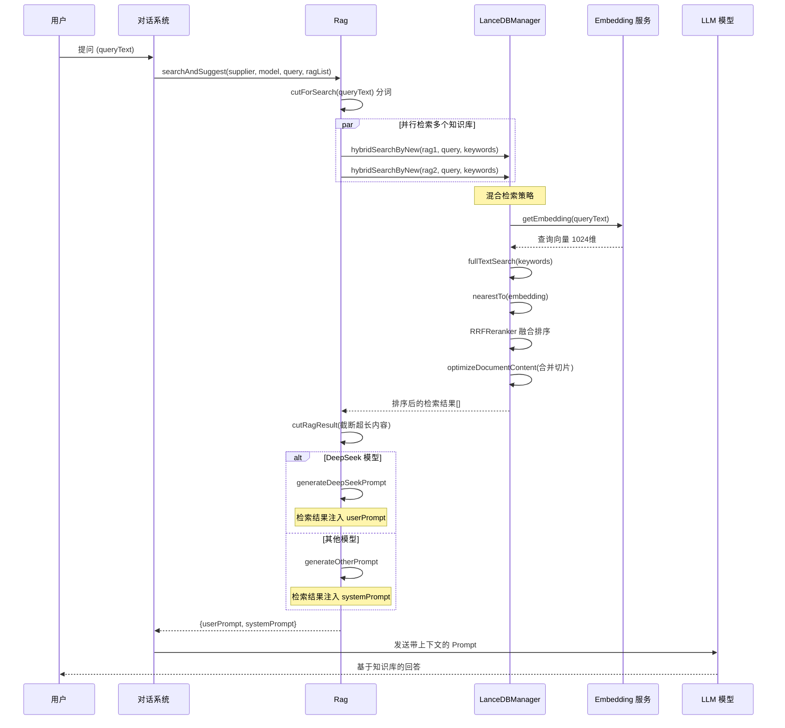
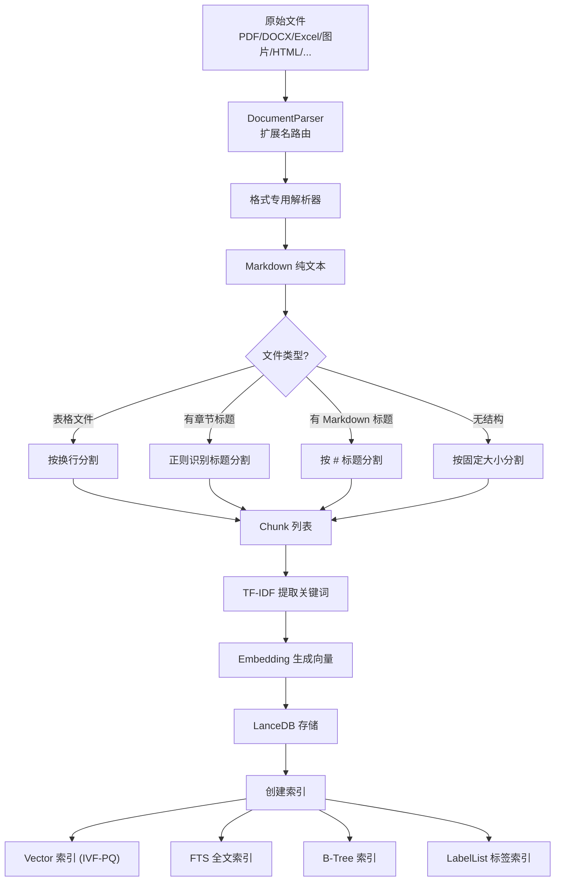
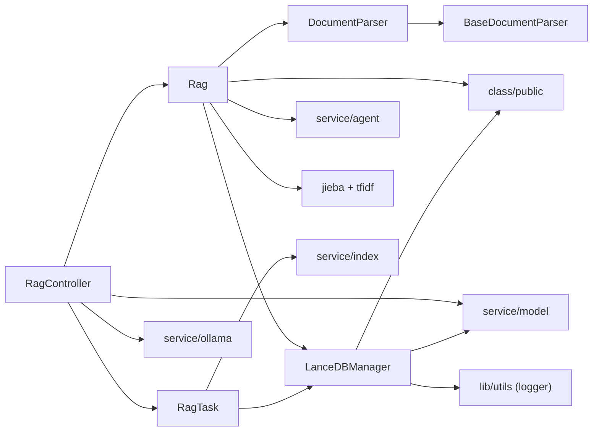

# RAG 方案 — 架构分析报告

> 生成时间：2026-04-01
> 分析范围：`src/main/rag/` + `src/main/controller/rag.ts`

---

## 1. 模块概览

### 1.1 模块定位

本项目的 **检索增强生成（Retrieval-Augmented Generation, RAG）** 完整实现方案。运行在 Electron 主进程中，负责文档解析、文本分割、向量化入库、混合检索、Prompt 拼接等全链路工作，使 LLM 能够基于用户私有知识库回答问题。

### 1.2 目录结构

```
src/main/rag/
├── rag.ts                          → 核心调度器（检索 + Prompt 拼接 + 文档管理）
├── rag_task.ts                     → 后台任务（文档分割、分隔符识别、递归切分）
├── doc_engins/
│   ├── doc.ts                      → 文档解析调度器（扩展名 → 解析器映射）
│   ├── utils.ts                    → 路径工具函数
│   └── libs/
│       ├── base_parser.ts          → 抽象基类（文件验证、图片保存通用逻辑）
│       ├── pdf_parse.ts            → PDF 解析 (pdfjs-dist)
│       ├── docx_parse.ts           → Word DOCX 解析 (pizzip + XML 解析)
│       ├── doc_parse.ts            → 旧版 DOC 解析 (word-extractor)
│       ├── ppt_parse.ts            → PPT 演示文稿解析
│       ├── xls_parse.ts            → Excel 解析 (xlsx)
│       ├── csv_parse.ts            → CSV 解析
│       ├── html_parse.ts           → HTML 解析 (cheerio)
│       ├── http_parse.ts           → 远程 URL 抓取解析
│       ├── txt_parse.ts            → 纯文本 / Markdown 解析
│       └── image_parse.ts          → 图片 OCR (tesseract.js)
└── vector_database/
    └── vector_lancedb.ts           → LanceDB 向量数据库管理（2000+ 行核心）

关联文件：
src/main/controller/rag.ts          → IPC 控制器（前端 API 入口，800+ 行）
```

| 文件                                | 行数  | 职责                                                                      |
| ----------------------------------- | ----- | ------------------------------------------------------------------------- |
| `rag.ts`                            | ~700  | 核心调度：文档管理、检索编排、Prompt 模板引擎、结果截断                   |
| `rag_task.ts`                       | ~300  | 后台任务：文档分割（Markdown 感知 + 递归分割 + 自动分隔符识别）           |
| `doc_engins/doc.ts`                 | ~200  | 文档解析调度：扩展名 → 解析器的路由映射（支持 20+ 种格式）                |
| `doc_engins/libs/base_parser.ts`    | ~100  | 抽象基类：文件验证、图片保存、资源清理的通用逻辑                          |
| `vector_database/vector_lancedb.ts` | ~2000 | 向量数据库全部操作：Embedding 生成/缓存、表管理、CRUD、混合检索、结果优化 |
| `controller/rag.ts`                 | ~800  | IPC 控制器：知识库 CRUD、文档上传下载、索引管理、搜索接口                 |

---

## 2. 架构分析

### 2.1 整体架构图



### 2.2 分层结构

| 层级             | 职责                                        | 关键文件                            |
| ---------------- | ------------------------------------------- | ----------------------------------- |
| **IPC 控制器层** | 接收前端请求，参数校验，路由到核心逻辑      | `controller/rag.ts`                 |
| **核心调度层**   | 编排文档管理、检索、Prompt 拼接的完整流程   | `rag.ts`, `rag_task.ts`             |
| **文档解析引擎** | 将 20+ 种文件格式统一转换为 Markdown 纯文本 | `doc_engins/`                       |
| **向量数据库层** | Embedding 生成、存储、索引、混合检索        | `vector_database/vector_lancedb.ts` |
| **存储层**       | 原始文件、解析结果、图片、知识库配置        | 文件系统 `rag/{ragName}/`           |

### 2.3 核心类关系图



### 2.4 设计模式

| 模式                           | 应用位置                                  | 解决的问题                                                     |
| ------------------------------ | ----------------------------------------- | -------------------------------------------------------------- |
| **策略模式 (Strategy)**        | `DocumentParser.FILE_TYPE_MAP`            | 根据文件扩展名动态选择解析器，新增格式只需添加映射             |
| **模板方法 (Template Method)** | `BaseDocumentParser` 抽象类               | 抽取文件验证、图片保存等通用逻辑，子类只需实现 `parse()`       |
| **工厂模式**                   | `getTemplate(agent_name)`                 | 根据 Agent 配置动态生成不同的 Prompt 模板                      |
| **状态机**                     | `doc_table.is_parsed` 字段 (0→2→1)        | 文档处理状态追踪：未解析 → 已解析待向量化 → 完成               |
| **缓存模式**                   | `getEmbeddingCache` / `setEmbeddingCache` | 基于文件系统的 Embedding 缓存，7 天过期清理                    |
| **管线模式 (Pipeline)**        | 文档处理全链路                            | 原文件 → 解析 → 分割 → 关键词提取 → 向量化 → 入库              |
| **适配器模式**                 | `searchAndSuggest` 结果格式转换           | 将 RAG 检索结果适配为搜索引擎格式 (`link`, `title`, `content`) |

---

## 3. 业务场景与流程

### 3.1 核心业务场景

| 场景             | 入口                 | 涉及组件                                              |
| ---------------- | -------------------- | ----------------------------------------------------- |
| **创建知识库**   | `create_rag()`       | Controller → 文件系统 (创建目录 + config.json)        |
| **上传文档**     | `upload_doc()`       | Controller → Rag → doc_table (标记 is_parsed=0)       |
| **后台文档处理** | 定时轮询             | RagTask → DocumentParser → 分割 → Embedding → LanceDB |
| **知识库问答**   | `searchAndSuggest()` | Rag → 并行检索 → 混合排序 → Prompt 拼接 → LLM         |
| **重建索引**     | `reindex_document()` | Controller → 重置 is_parsed=0 → 触发后台重新处理      |
| **删除知识库**   | `remove_rag()`       | Controller → Rag → 删除 doc_table + 向量表 + 文件     |

### 3.2 文档上传与索引 — 时序图



### 3.3 检索增强问答 — 时序图



### 3.4 文档处理管线 — 数据流图



---

## 4. 知识点详解

### 4.1 LanceDB — 嵌入式向量数据库

**是什么**：LanceDB 是一个用 Rust 编写的嵌入式向量数据库，基于 Lance 列式存储格式。它直接运行在应用进程中（无需独立服务），支持向量搜索、全文搜索和标量过滤的混合查询。适合 Electron 桌面应用这类需要离线运行的场景。

**为什么选择 LanceDB 而非 Chroma/Pinecone/Milvus**：

- **嵌入式**：无需部署独立的数据库服务，适合桌面端分发
- **文件级存储**：数据以 `.lance` 文件存储，可直接随应用打包/迁移
- **混合搜索**：原生支持向量 + FTS + 标量过滤组合查询
- **零配置**：直接 `lancedb.connect(path)` 即可使用

**在本项目中的用法**：

```typescript
// 来自 vector_lancedb.ts — 连接数据库
const db = await lancedb.connect(pub.get_db_path())

// 创建表 — 第一条数据定义 schema
await db.createTable(tableName, [
  {
    id: '1',
    doc: text,
    vector: embedding,
    docId: '0',
    tokens: text,
    keywords: ['k1', 'k2'],
  },
])

// 多种索引类型
await tableObj.createIndex('vector', { config: lancedb.Index.ivfPq({ distanceType: 'cosine' }) })
await tableObj.createIndex('tokens', { config: lancedb.Index.fts() })
await tableObj.createIndex('docId', { config: lancedb.Index.btree() })
await tableObj.createIndex('keywords', { config: lancedb.Index.labelList() })
```

**还能怎么用**：

- LanceDB 支持 HNSW 索引 (`hnswPq`, `hnswSq`)，比 IVF-PQ 在小数据集上更快
- 支持 `bitmap` 索引用于枚举值过滤
- 可以利用 `tableObj.mergeInsert()` 做增量更新

### 4.2 向量嵌入 (Embedding) — 将文本变成数学向量

**是什么**：Embedding 是将文本映射到高维向量空间的过程。语义相近的文本在向量空间中距离更近。本项目使用 1024 维向量（`DIMENSION = 1024`），这是 `bge-m3` 模型的输出维度。

**类比理解**：想象一个巨大的多维坐标系。「猫」和「小猫」的坐标很近，「猫」和「汽车」的坐标很远。向量搜索就是在这个空间里找"距离最近的"文本片段。

**为什么这样用**：项目支持两种 Embedding 来源，通过 `supplierName` 切换：

```typescript
// 来自 vector_lancedb.ts L260-L280
if (supplierName == 'ollama') {
  // 本地 Ollama 服务（离线可用）
  const ollama = pub.init_ollama()
  res = await ollama.embeddings({ model, prompt: text })
} else {
  // 第三方 API（如 OpenAI、智谱等）
  let modelService = new ModelService(supplierName)
  res = await modelService.embedding(model, text)
}

// 维度不足时零填充（兼容不同模型）
if (res.embedding.length < this.DIMENSION) {
  const padding = new Array(this.DIMENSION - res.embedding.length).fill(0)
  res.embedding = res.embedding.concat(padding)
}
```

关键设计：**基于文件系统的 Embedding 缓存**

```typescript
// 缓存 key = md5(supplierName + model + text)
let key = pub.md5(`${supplierName}-${model}-${text}`)
let embedding = await this.getEmbeddingCache(key)
if (embedding.length > 0) return embedding // 命中缓存直接返回
// ... 生成后写入缓存文件
await this.setEmbeddingCache(key, res.embedding)
```

缓存策略：每个向量存为独立 JSON 文件，7 天未访问自动清理。

### 4.3 混合检索 (Hybrid Search) — 向量 + 关键词双路融合

**是什么**：单纯的向量搜索擅长语义匹配（"快乐" 能找到 "开心"），但可能漏掉精确的关键词匹配。混合检索同时使用向量相似度搜索和关键词全文搜索，然后用融合算法合并结果。

**项目中的两套实现**：

**方案一：RRF Reranker（hybridSearchByNew）** — 更简洁的新方案

```typescript
// 来自 vector_lancedb.ts — 使用 LanceDB 内置的 RRF 融合
let sortedResults = await tableObj
  .query()
  .fullTextSearch(keywords.join(' ')) // 全文检索
  .nearestTo(embedding) // 向量检索
  .rerank(await lancedb.rerankers.RRFReranker.create()) // RRF 融合排序
  .select(['id', 'doc', 'docId', 'tokens'])
  .limit(ragInfo.maxRecall)
  .toArray()
```

RRF (Reciprocal Rank Fusion): 对每个文档在两种检索中的排名取倒数再求和：$score = \sum_{i} \frac{1}{k + rank_i}$，其中 $k$ 是常数（通常 60）。排名越靠前的结果获得越高分。

**方案二：加权融合（hybridSearch）** — 手动控制权重的旧方案

```typescript
// 并行执行两种搜索
await Promise.all([
  this.performVectorSearch(tableObj, ragInfo, queryText, resultMap),
  this.performKeywordSearch(tableObj, keywords, keywordWeight, resultMap)
])

// 关键词评分公式
score = uniqueMatchScore × 0.7   // 匹配的唯一关键词比例
      + occurrenceScore × 0.2    // 关键词出现总次数
      + positionBonus × 0.1      // 位置加权（越靠前越好）
```

### 4.4 文本分割 (Chunking) — 智能文档切分策略

**是什么**：LLM 的上下文窗口有限，不能把整篇文档塞进去。Chunking 把长文档切成重叠的小块（chunk），每块独立向量化。检索时只返回最相关的几个 chunk。

**项目中的多层切分策略**：

```
第 1 层：Markdown 标题分割（# / ## / ### 等）
    ↓ 如果某个 section 仍然超长
第 2 层：智能分隔符识别（"第X章"、"第X条" 等中文正则）
    ↓ 如果还是太长
第 3 层：段落分割（\n\n）
    ↓ 最终兜底
第 4 层：固定大小滑动窗口（chunkSize + overlapSize）
```

**核心代码逻辑**（来自 `rag_task.ts`）：

```typescript
// 按 Markdown 标题分块
const headingMatches = [...docBody.matchAll(/^#{1,6}\s+.+$/gm)]
if (headingMatches.length > 1) {
  for (let i = 0; i < headingMatches.length; i++) {
    const section = docBody.substring(currentMatch.index!, nextMatch?.index || docBody.length)
    if (section.length <= chunkSize) {
      chunks.push(section.trim()) // 不超过 chunkSize 直接作为一个 chunk
    } else {
      chunks.push(...this.splitTextBySize(section, chunkSize, overlapSize, minSizeForOverlap))
    }
  }
}

// 自动识别中文文档分隔符
const patt_list = [
  /(第.{1,10}章[\s\:\.：])/g, // "第一章"、"第二十三章"
  /(第.{1,10}条[\s\:\.：])/g, // "第一条"
  /(第.{1,10}节[\s\:\.：])/g, // "第一节"
  /(\s[一二三四五六七八九十]{1,5}[\s:\.：、])/g, // "一、" "二、"
  /(Slide\s+\d+)/g, // PPT 幻灯片
]
```

**Overlap（重叠区域）**：相邻 chunk 之间有 `overlapSize` 字符的重叠，确保跨 chunk 边界的句子不会丢失上下文。只有当 chunk 大于 `minSizeForOverlap` 时才保留重叠。

### 4.5 TF-IDF 关键词提取 — 文档指纹

**是什么**：TF-IDF (Term Frequency-Inverse Document Frequency) 衡量一个词对文档的重要程度。一个词在某文档中出现频率高（TF 高），但在其他文档中很少出现（IDF 高），那它就是这篇文档的关键词。

**为什么需要**：结合 jieba 中文分词，提取 5 个关键词存入向量表的 `keywords` 字段，供关键词检索和 LabelList 索引使用。

```typescript
// 来自 rag.ts
import { jieba, tfidf } from '../class/public'
public async generateKeywords(doc: string, num: number = 5): Promise<string[]> {
  let result = tfidf.extractKeywords(jieba, doc, num)
  return result.map((item: any) => item.keyword)
}
```

**jieba**：`@node-rs/jieba` 是 jieba 分词的 Rust binding，性能远优于纯 JS 实现，特别适合处理中文文档的分词需求。

### 4.6 Prompt 模板引擎 — 检索结果注入 LLM

**是什么**：RAG 的最后一步——将检索到的知识片段组装成 LLM 能理解的 Prompt。不同模型需要不同的 Prompt 格式。

**两种模板策略**：

| 模型类型 | Prompt 策略                 | 原因                                           |
| -------- | --------------------------- | ---------------------------------------------- |
| DeepSeek | 检索结果放入 `userPrompt`   | DeepSeek 的 system prompt 效果不如 user prompt |
| 其他模型 | 检索结果放入 `systemPrompt` | 通用做法，system prompt 优先级更高             |

检索结果格式化示例（DeepSeek 风格）：

```
[检索结果 1 begin]
来源: /path/to/doc.md
内容: {文档片段内容}
[检索结果 1 end]
```

**Agent 集成**：如果配置了 Agent，会用 Agent 的自定义 prompt 替换默认提示词，实现角色化知识问答。

### 4.7 文档解析引擎 — 万能格式转换器

**是什么**：将 20+ 种文件格式统一转换为 Markdown 纯文本的解析框架。采用策略模式，通过扩展名映射到对应的解析函数。

**支持的格式一览**：

| 类别     | 格式                                             | 解析库                            |
| -------- | ------------------------------------------------ | --------------------------------- |
| **文档** | `.docx`, `.doc`                                  | pizzip (XML 解析), word-extractor |
| **表格** | `.xlsx`, `.xls`, `.csv`                          | xlsx                              |
| **演示** | `.pptx`, `.ppt`                                  | pizzip                            |
| **PDF**  | `.pdf`                                           | pdfjs-dist                        |
| **网页** | `.html`, `.htm`, `http://`                       | cheerio, axios                    |
| **图片** | `.jpg`, `.png`, `.gif`, `.bmp`, `.webp`, `.tiff` | tesseract.js (OCR)                |
| **文本** | `.txt`, `.md`, `.json`, `.log`, `.conf`, `.ini`  | 直接读取                          |

**核心路由逻辑**：

```typescript
// 来自 doc.ts
private static FILE_TYPE_MAP: Record<string, ParseFunction> = {
  '.docx': docxParse,
  '.pdf':  pdfParse,
  '.jpg':  imageParse,  // OCR
  'http':  httpParse,   // 远程抓取
  // ... 20+ 种映射
}

// 查找并调用对应解析器
const parseFunction = this.FILE_TYPE_MAP[extension]
const content = await parseFunction(filename, ragName)
```

**图片处理**：DOCX、PPT 等文档中的嵌入图片会被提取到 `images/` 目录，转换后的 Markdown 中引用图片 URL。

---

## 5. 设计难点与注意事项

### 5.1 技术难点

| 难点                   | 原因                                                               | 当前方案                                                                     |
| ---------------------- | ------------------------------------------------------------------ | ---------------------------------------------------------------------------- |
| **Embedding 维度兼容** | 不同模型输出维度不同（384/512/768/1024），但表 schema 固定 1024 维 | 不足维度用 0 填充 `padding`。缺陷：维度差异过大时余弦相似度计算不准确        |
| **大文档分割质量**     | 简单的固定大小切分会破坏语义完整性                                 | 多层策略：Markdown 标题 → 中文章节正则 → 段落 → 固定大小，并保留 overlap     |
| **混合检索权重调优**   | 向量与关键词检索的权重比例影响召回质量                             | 可配置 `vectorWeight` / `keywordWeight`；新方案用 RRF 自动融合，无需手动调权 |
| **中文分词质量**       | 直接影响关键词检索的召回率                                         | 使用 `@node-rs/jieba` Rust 实现，性能和分词质量优于纯 JS 方案                |
| **OCR 准确率**         | 图片文字识别受清晰度、字体、排版影响大                             | tesseract.js 支持中英双语，但对手写体、特殊排版效果不佳                      |
| **Prompt 长度控制**    | 检索结果过多会超出 LLM 上下文窗口                                  | `cutRagResult` 按模型类型截断：Ollama 6K, 第三方 48K                         |

### 5.2 潜在问题

1. **SQL 注入风险**：`buildKeywordConditions` 中直接拼接 SQL 条件字符串：

   ```typescript
   // vector_lancedb.ts
   return `doc LIKE '%${kw.replace(/'/g, "''")}%'`
   ```

   虽然做了单引号转义，但 LanceDB 的 where 语法可能有其他注入点。建议使用参数化查询（如果 LanceDB SDK 支持）。

2. **每次检索都创建新的 DB 连接**：`hybridSearch`、`search` 等方法每次调用都执行 `lancedb.connect()` + `db.close()`，频繁的连接/关闭有性能开销。建议引入连接池或复用连接。

3. **Embedding 缓存的文件系统压力**：每个文本片段生成一个独立 JSON 文件。大量文档入库时会产生数万个小文件，可能影响文件系统性能。建议改用批量缓存（如 SQLite 或合并存储）。

4. **`createMd` 在 Rag 中重复调用**：`addDocumentToDB` 每次都调用 `createDocTable` + `checkDocTableSchema`，包含 schema 迁移逻辑。高频调用时存在性能浪费。

5. **向量维度硬编码为 1024**：`DIMENSION = 1024` 是 `bge-m3` 的输出维度。如果用户切换到其他 Embedding 模型（如 OpenAI `text-embedding-3-small` 的 1536 维），需要重建所有向量表。建议将维度配置化。

6. **`optimizeDocumentContent` 的激进合并策略**：当检索到的切片总长超过原文 10% 时，直接替换为完整文档内容。这可能导致注入大量不相关的内容到 Prompt。

### 5.3 扩展注意事项

- **新增文档格式**：在 `doc_engins/libs/` 添加新 parser，继承 `BaseDocumentParser`，然后在 `doc.ts` 的 `FILE_TYPE_MAP` 中注册
- **切换向量数据库**：所有向量操作都封装在 `LanceDBManager` 中，替换时只需重新实现该类的接口
- **添加 Reranker 模型**：`ragInfo.resultReordering` 和 `ragInfo.rerankModel` 字段已预留，但尚未实现基于模型的重排序
- **Query 重写**：`ragInfo.queryRewrite` 字段已预留，可集成 LLM 做查询改写（将模糊查询转为精确检索词）
- **多语言支持**：当前分词用 jieba（中文优化），英文等西文场景需要考虑替换分词器

### 5.4 最佳实践

- 创建知识库时选择合适的 Embedding 模型：中文文档推荐 `bge-m3`，英文文档可用 `nomic-embed-text`
- `chunkSize` 建议 500-1000，`overlapSize` 建议 50-200，根据文档类型调整
- 表格类文件（Excel/CSV）适合较小的 chunkSize 和按行分割
- 定期调用 `optimizeTable` 回收 LanceDB 的已删除空间
- 检索时优先使用 `hybridSearchByNew`（RRF 融合），比手动权重调节更稳定

---

## 6. 依赖关系

### 6.1 内部依赖



### 6.2 外部依赖

| 依赖包             | 版本 | 用途                               |
| ------------------ | ---- | ---------------------------------- |
| `@lancedb/lancedb` | —    | 嵌入式向量数据库（核心存储与检索） |
| `openai`           | —    | OpenAI 兼容 API 的 Embedding 生成  |
| `ollama`           | —    | 本地 Ollama 服务的 Embedding 生成  |
| `pdfjs-dist`       | —    | PDF 文本提取                       |
| `pizzip`           | —    | DOCX/PPTX ZIP 包解析               |
| `xlsx`             | —    | Excel 文件解析                     |
| `word-extractor`   | —    | 旧版 .doc 文件提取                 |
| `tesseract.js`     | —    | 图片 OCR 文字识别                  |
| `cheerio`          | —    | HTML DOM 解析                      |
| `@node-rs/jieba`   | —    | 中文分词（Rust binding，高性能）   |
| `iconv-lite`       | —    | 文件编码转换                       |
| `axios`            | —    | HTTP 请求（远程 URL 抓取）         |
| `uuid`             | —    | 唯一 ID 生成                       |

---

## 附录

### 知识库文件系统结构

```
{DATA_DIR}/rag/{ragName}/
├── config.json        → 知识库配置（名称、Embedding 模型、检索策略等）
├── source/            → 原始上传文件
├── markdown/          → 解析后的 Markdown 文件
└── images/            → 从文档中提取的图片

{DATA_DIR}/rag/vector_db/
├── doc_table.lance    → 文档元数据表（统一管理所有知识库的文档）
├── {md5(ragName)}.lance → 各知识库的向量表

{DATA_DIR}/embedding_cache/
├── {md5}.json         → Embedding 向量缓存文件（7天过期）
```

### 关键 API 速查表

| API / 方法                                           | 参数                        | 返回值                       | 说明                              |
| ---------------------------------------------------- | --------------------------- | ---------------------------- | --------------------------------- |
| `Rag.searchDocument(ragList, queryText)`             | 知识库列表 + 查询文本       | 检索结果数组                 | 并行搜索多个知识库                |
| `Rag.searchAndSuggest(...)`                          | 供应商/模型/查询/文档/Agent | `{userPrompt, systemPrompt}` | 完整 RAG 链路：检索 → Prompt 拼接 |
| `Rag.addDocumentToDB(...)`                           | 文件名/知识库名/分割参数    | —                            | 注册文档到 doc_table（异步处理）  |
| `RagTask.docChunk(text, size, overlap)`              | 文本 + 分割参数             | `string[]`                   | 智能文档分割                      |
| `RagTask.defaultSeparators(seps, file, text)`        | —                           | `string[]`                   | 自动识别中文文档分隔符            |
| `LanceDBManager.createTable(name, ...)`              | 表名/供应商/模型/初始文本   | 表名                         | 创建带索引的向量表                |
| `LanceDBManager.addDocuments(...)`                   | 表名/文本数组/关键词数组    | 添加数量                     | 批量向量化 + 入库                 |
| `LanceDBManager.hybridSearchByNew(...)`              | 表名/ragInfo/查询/关键词    | `QueryResult[]`              | RRF 混合检索（推荐）              |
| `LanceDBManager.hybridSearch(...)`                   | 同上                        | `QueryResult[]`              | 加权混合检索（旧方案）            |
| `LanceDBManager.getEmbedding(supplier, model, text)` | 供应商/模型/文本            | `number[1024]`               | 带缓存的 Embedding 生成           |
| `DocumentParser.parseDocument(file, rag)`            | 文件路径/知识库名           | `ParseResult`                | 万能文档解析                      |

### 检索策略配置说明

| 参数               | 类型   | 默认值 | 说明                                   |
| ------------------ | ------ | ------ | -------------------------------------- |
| `searchStrategy`   | 1/2/3  | 2      | 1=混合检索 2=向量检索 3=全文检索       |
| `maxRecall`        | number | 5      | 最大召回文档数                         |
| `recallAccuracy`   | number | 0.1    | 召回精度阈值（低于此分数的结果被过滤） |
| `vectorWeight`     | 0~1    | 0.7    | 向量检索权重                           |
| `keywordWeight`    | 0~1    | 0.3    | 关键词检索权重                         |
| `resultReordering` | 0/1    | 1      | 结果重排序开关（已预留，未完全实现）   |
| `queryRewrite`     | 0/1    | 0      | 查询重写开关（已预留，未实现）         |
